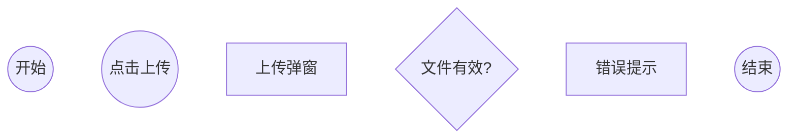
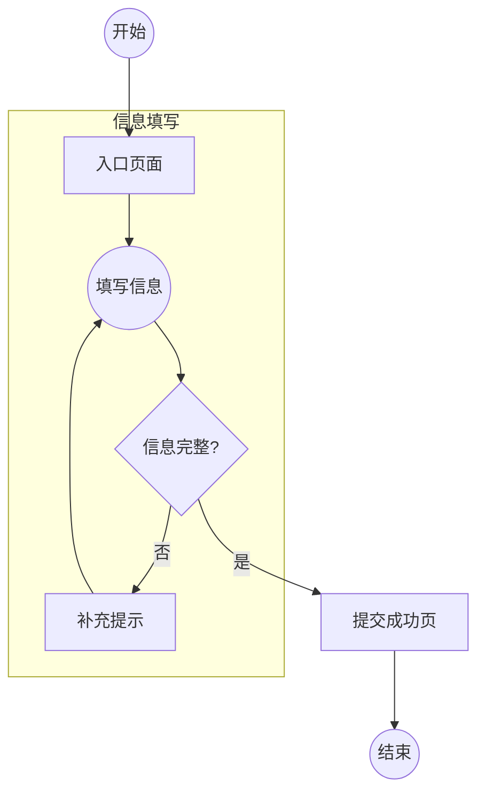
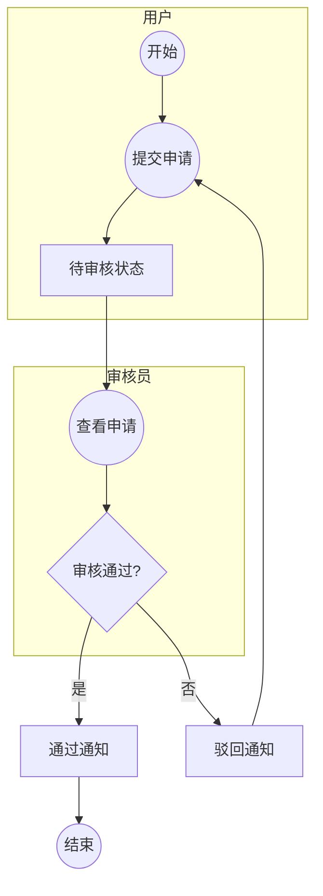

# PRD to Mermaid User Flow

Use this skill to turn product requirements into a clear, renderable Mermaid user flow that describes what the user sees, decides, and does from entry to task completion.

## Output Contract

- Output only one fenced `mermaid` code block unless the user explicitly asks for explanation, critique, or multiple alternatives.
- Default to `flowchart TD`; use `flowchart LR` only when a short linear comparison or handoff flow is easier to read horizontally.
- Keep the diagram user-centered. Show pages, dialogs, user actions, visible states, decisions, errors, and outcomes. Omit backend jobs, internal services, database writes, and implementation details unless the user directly experiences them.
- If the PRD is incomplete, infer only common UX prerequisites needed for the stated task, such as login, validation, retry, cancel, or success states. Do not invent unrelated features or roles.
- Ask a clarifying question only when the user's goal, primary actor, or core task cannot be identified.

## Extraction Workflow

Before writing Mermaid, silently build this inventory:

1. Core user goal: the final user-visible outcome.
2. Entry points: homepage, dashboard, notification, deep link, shared link, login, or external referral.
3. Happy path: the shortest successful path from entry to outcome.
4. Surfaces: pages, screens, dialogs, forms, state pages, result pages, empty states, and error states.
5. User actions: click, select, search, fill, upload, submit, confirm, pay, approve, reject, retry, cancel.
6. Decisions: login status, permission, eligibility, completeness, validation, payment, review, availability, conflict, quota, timeout.
7. Recovery paths: return to fill, re-upload, reselect, retry payment, log in again, contact support, exit, or return to the previous page.
8. Role or task boundaries: separate multiple actors, phases, or core tasks only when they materially improve readability.

Then reduce the inventory:

- Merge repeated surfaces that represent the same user state.
- Collapse low-value micro-actions, such as focus field, scroll, or hover.
- Keep every branch connected back to either recovery, completion, or a deliberate exit.
- Prefer one reusable retry loop over duplicate copies of the same form, upload, payment, or submission path.

## Mermaid Rules

Use these shapes consistently:

- Start and end: `Start((开始))` and `End((结束))`.
- User actions: `A1((提交申请))`.
- Pages, dialogs, forms, visible statuses, and results: `P1[申请表单]`.
- Decisions: `D1{信息完整?}`.
- Normal edges: `-->`.
- Decision edges: `-- 是 -->`, `-- 否 -->`, or short domain-specific labels such as `-- 已登录 -->`.

Keep node IDs Mermaid-safe and labels readable:

- Use ASCII node IDs such as `A1`, `P2`, `D3`, `AdminA1`; never use spaces, punctuation, or Chinese in IDs.
- Use concise labels. Chinese labels should usually be 3-8 characters; English labels should usually be 2-6 words.
- Start user-action labels with verbs. Use nouns for pages and states. Use question form for decisions.
- Put one action or one visible state in each node.
- Avoid long labels, raw line breaks inside labels, markdown, HTML, emojis, and implementation terms in node labels.

## Structure Rules

Use `subgraph` only when it improves scanability:

- For phases: `登录与权限`, `浏览与选择`, `信息填写`, `上传与校验`, `支付流程`, `提交流程`, `审核流程`, `结果反馈`, `异常处理`.
- For roles: one subgraph per role, such as `用户`, `审核员`, `管理员`, `商家`.
- For multiple core tasks: one subgraph per task or phase, then connect shared entry and final result nodes.

Subgraph pattern:

For multi-role flows, connect role handoffs through user-visible states:

## Quality Check

Before final output, verify:

- The happy path reaches `End`.
- Every decision branch has a target.
- Every error path returns to a reasonable correction point or exits intentionally.
- All node IDs are unique and ASCII-safe.
- Shape usage is consistent with node meaning.
- The diagram is concise enough to redraw in Figma without cleanup.
- The Mermaid code has no prose outside the fenced code block.
